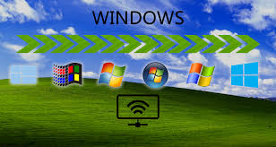
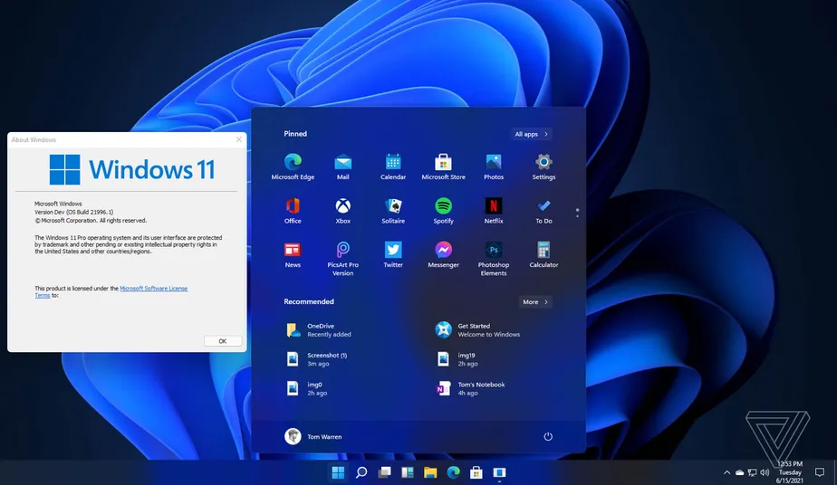
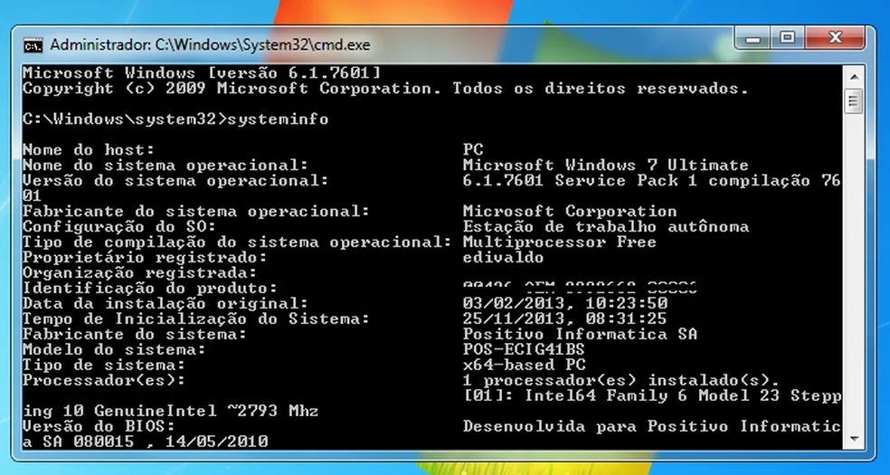

## Pesquisa sobre o Windows 🖥
### Evolução dos sistemas operacionais 
## Em que ano isso tudo começou?
Em **1950** iniciou a evolução dos sistemas operacionais, porém com sistemas simples e linhas de comando como o **UNIX** e o **MS-DOS**. Em 1980 á 1990 surgiram sistemas como o *Windows* e o *MAC OS*, que inseriu interfaces gráficas e com maior facilidade de uso. Depois dos anos 2000 com o avanço da tecnologia, os sistemas como **Windows XP**, **Linux**, **Mac OS X** e o **Android** para dispositivos móveis começaram a dominar, oferecendo mais funcionalidades e maior integração com a internet e dispositivos móveis.
 Em suma, o sistema operacional é um software fundamental que gerencia o hardware de um computador e permite que os programas sejam executados, ele fornece uma interface entre o usuário e o hardware, facilitando o controle de dispositivos, arquivos, memória e processadores, o Sistema Operacional garante que os recursos do computador sejam utilizados de maneira eficiente e segura, além de facilitar a interação do usuário com o dispositivo.
 ## Oque é Windows?
 O Windows é um sistema operacional desenvolvido pela Microsoft, ele é um dos **mais populares do mundo** e serve como plataforma para executar programas de computador e interagir com o hardware de um dispositivo, como um PC. O Windows oferece uma interface gráfica que facilita o uso de computadores, com elementos como janelas, ícones, menus e botões.
A **primeira** versão do Windows foi lançada em **1985**, e ao longo dos anos, o sistema passou por várias atualizações e melhorias, como o Windows 95, Windows XP, Windows 7, Windows 10, e atualmente, o Windows 11. Ele é utilizado tanto por usuários domésticos quanto em ambientes corporativos, e é compatível com uma grande variedade de softwares e periféricos
## Cinco versões importantes do Windows
- **Windows 95 de 1995**, um dos seus principais destaques foi o Menu Iniciar, a Lixeira e Barras de Tarefas, em 1995 quem quisse comprar teria que desembolsar 230 Reais para ter o Sistema Operatorio
- **Windowns XP de 2001**, trouxe estabilidade  e uma interface visual mais amigável, foi uma das versões mais populares e duradouras do Windows.
- **Windows 7 de 2009**, um dos seus principais destaques foi a melhora da  performance e a segurança, com uma interface simplificada e recursos como o Aero Glass, foi amplamente adotado por usuários e empresas.
- **Windows 10 de 2015**, introduziu a integração com a nuvem, o navegador Microsoft Edge e o retorno do menu Iniciar, uma versão focada em atualização contínua.
- **Windows 10 de 2021**,  apresentou uma nova interface mais moderna e limpa, além de melhorias em desempenho, suporte a multitarefa e recursos para dispositivos modernos.

## Arquitetura do Windows
Na Arquietetura do Windowns tem varias camadas como o Modo de Usuário, Interface Grafica, API, Gerenciador de Arquivos, Kernel, Gerenciador de Processos, Gerenciador de memórias, Drivers de Depositivos, Gerenciador de entrada e saida, Segurança de Controle de acessos, Sistema de Rede. 
- **Modo Usuário**: executa programas e processos do usuário, garantindo a interação com o sistema. 
- **Interface Gráfica (GUI)**: Fornece a interface visual do sistema, como o desktop, janelas e menus.
- **API**: Permite que aplicativos interajam com o sistema operacional de forma eficiente.
- **Gerenciador de Arquivos**: Organiza e controla o acesso a arquivos e dispositivos de armazenamento
- **Kernel**: Gerencia o hardware e recursos do sistema, como memória e processadores.
- **Gerenciador de Processos**: Controla a execução de programas e a alocação de recursos.
- **Gerenciador de Memória**: Gerencia a memória RAM e a alocação de espaço para processos.
- **Drivers de Dispositivos**: Permite a comunicação entre o sistema e o hardware, como impressoras e placas de vídeo.
- **Gerenciador de entrada e saída**: Controla a transferência de dados entre o sistema e os dispositivos externos.
- **Segurança e Controle de Acesso**: Protege o sistema e os dados, gerenciando permissões e autenticação
- **Sistema de Rede**: Gerencia a comunicação e o compartilhamento de recursos entre computadores e dispositivos na rede.

## Comandos e suas Funções
- `dir`
 Lista os arquivos e pastas dentro de um diretório (pasta).
- ``cd`` Muda o diretório (pasta) atual no qual você está.
- ``mkdir`` Cria uma nova pasta no diretório atual.
- ``del`` Exclui arquivos
- ``ipconfig`` Exibe as configurações de rede do seu computador (endereço IP, máscara de sub-rede, etc).

## Conclusão 
- O Windows passou por diversas versões, desde o Windows 1.0, lançado em 1985, até o Windows 11, com mudanças significativas em interface o desempenho e usabilidade.
- introduziu marcos importantes como o Menu Iniciar, a centralização da interfac, e a atualização contínua.
- o Windows é a principal plataforma para jogos no PC, com suporte ao DirectX e outras tecnologias para otimizar o desempenho.
- suporta uma vasta gama de hardware e software, o que o torna acessível e útil para diferentes tipos de usuários.